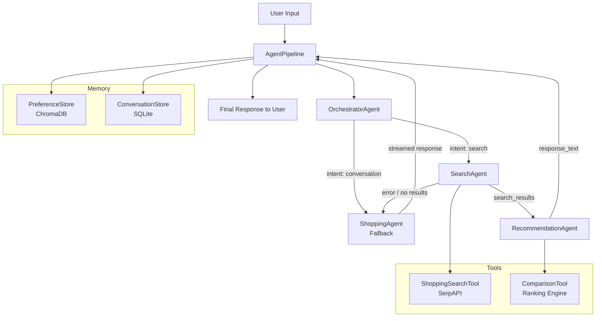

# Multi-Agent Architecture

## Pipeline Flow

## Agent Responsibilities

| Agent | Role | Input | Output |
|-------|------|-------|--------|
| **OrchestratorAgent** | Intent detection, query decomposition | User message + history | Intent + search queries + budget allocation |
| **SearchAgent** | Product search via SerpAPI | Search queries | Raw product results |
| **RecommendationAgent** | Ranking + explanation | Products + preferences | Ranked recommendations with explanations |
| **ShoppingAgent** (fallback) | Conversational chat, tool use | User message | Streamed text response |

## Graceful Degradation

1. If the orchestrator fails to parse intent -> falls back to ShoppingAgent
2. If search returns no results -> falls back to ShoppingAgent
3. If recommendation agent fails -> returns formatted results without LLM synthesis
4. If SerpAPI key is missing -> search disabled, chat still works
